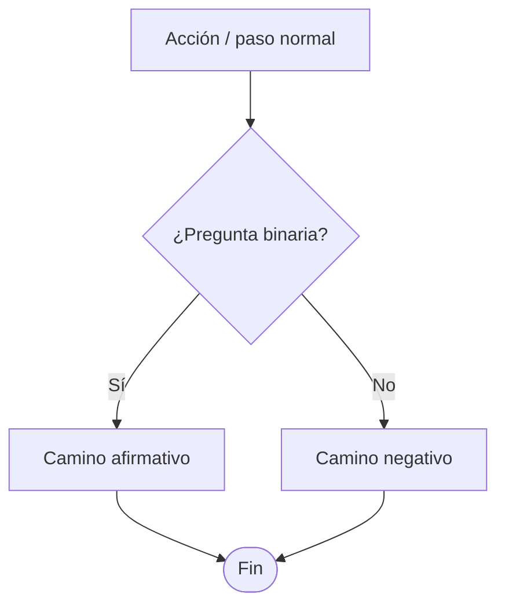

# Flujogramas — estándar del proyecto

Un flujograma mal hecho es peor que no tener flujograma: alguien lo va a leer como si fuera la verdad del proceso, y si miente (por omisión, por ambigüedad, por una rama de decisión que no lleva a ningún lado) esa mentira se propaga — a un auditor de calidad leyendo un procedimiento del SIG, a un desarrollador que asume que un `if` tiene el mismo camino que el diagrama, a un compañero que confía en tu reporte técnico sin leer el código. El valor de un flujograma no es decorativo: es que le ahorra a un lector frío el trabajo de reconstruir un mecanismo a partir de prosa. Si una frase lo dice más rápido, escribe la frase.

## Primero: ¿qué tipo de flujograma es?

Este repo tiene dos trabajos distintos que se ven parecidos pero exigen criterios opuestos. Decide cuál es antes de dibujar una sola caja.

| | **A. Transcripción de procedimiento SIG** | **B. Diagrama explicativo** |
|---|---|---|
| ¿Cuándo? | `sig_analyze_full`/`sig_set_flujograma_mmd`, o cualquier flujograma que representa un procedimiento oficial de la empresa | Reportes técnicos (`docs/`, Reportes de Desarrollo, `sig.md`/`directorio.md`/`ally-tickets.md`/`mantenimiento.md`), explicar un fix, comparar antes/después |
| ¿Qué manda? | **Fidelidad al documento original.** Es casi un documento legal — lo audita Calidad. | **Que el mecanismo se entienda.** Es tuyo, lo diseñas para que se lea rápido. |
| ¿Puedes "mejorar" el proceso al dibujarlo? | **No.** Si el documento tiene un vacío o una ambigüedad, transcríbelo tal cual — señalar mejoras es trabajo de `sig_analyze_mejoras`, no de la transcripción. | Sí — el diagrama es tu explicación, puedes simplificar lo que no aporta al punto que estás haciendo. |
| ¿De dónde sale cada caja? | Del texto del procedimiento y/o `flujogramaImagenBase64` (la imagen del flujograma original, si el documento la tenía) — nunca inventada. | De tu lectura real del código (archivo:línea) — nunca de lo que "debería" hacer. |

Ir a la sección [A](#a--transcripción-de-procedimiento-sig) o [B](#b--diagrama-explicativo) según corresponda; los principios universales de abajo aplican a las dos.

## Principios universales

Estos vienen del estándar ISO 5807 (símbolos de flujograma) y de dos décadas de práctica en mapeo de procesos — no son un capricho de estilo, cada uno existe porque su ausencia rompe la lectura de alguien que no tiene tu contexto:

1. **Un inicio, uno o más finales, siempre marcados.** Terminador (óvalo/rombo redondeado) al entrar y al salir. Un flujograma sin final claro deja al lector sin saber si el proceso "sigue" o si tú simplemente dejaste de dibujar.
2. **Un rombo = una pregunta con respuesta binaria (o enumerable).** Nunca combines dos condiciones en un solo rombo ("¿el monto es alto Y no tiene aprobación?") — sepáralas, porque cada una puede tener su propio camino de falla que el lector necesita ver por separado.
3. **Cada camino que sale de una decisión tiene que llegar a algún lado.** Una rama que no conecta a otro paso o a un final es una pregunta implícita sin responder: "¿y si no?". Ese es exactamente el tipo de vacío que un auditor o un desarrollador va a asumir mal.
4. **Sé consistente con la dirección de Sí/No.** Elige una convención (ej. "Sí" sigue hacia abajo, "No" se desvía a un lado) y mantenla en todo el diagrama — mezclarla obliga al lector a releer cada rombo en vez de reconocer el patrón.
5. **Una caja, una acción.** "Validar y aprobar la solicitud" son dos pasos que pueden fallar por separado — sepáralos si el fallo de uno importa.
6. **Etiqueta las flechas cuando la relación no es obvia.** Una flecha desnuda entre dos cajas dice "estas cosas están relacionadas de algún modo" — `valida`, `notifica`, `cada 30s`, `si falla` es información real. No hace falta etiquetar un flujo puramente secuencial (paso 1 → paso 2), sí hace falta en bifurcaciones, reintentos, o callbacks async.
7. **Nombres de nodo descriptivos, no genéricos.** "Validar disponibilidad de cupo" en vez de "Paso 3" — un flujograma con `A`, `B`, `C` como único texto no le ahorra trabajo a nadie, solo lo traslada.
8. **El nivel de detalle es proporcional a lo que la decisión/proceso realmente exige.** Ni un diagrama de 3 cajas para un proceso con 4 bifurcaciones reales (mentira por omisión), ni 40 cajas para algo esencialmente lineal (ruido que esconde el punto). Pregúntate: ¿qué pasos tienen una rama de decisión o pueden fallar de una forma que le importa al lector? Esos son los que se dibujan con detalle; el resto se puede colapsar en un solo paso.
9. **Sin líneas cruzadas.** Si dos flechas se cruzan, reordena las cajas — un cruce no es "mala suerte de layout", es una señal de que el flujo tiene una estructura que el diagrama todavía no refleja bien (por ejemplo, dos procesos independientes que deberían ser dos subgrafos, no uno).
10. **¿Dos o más personas/áreas con handoffs reales?** Usa carriles (swimlanes — en Mermaid, `subgraph` por rol/área). No hace falta para un proceso de una sola persona; sí aporta muchísimo en cuanto hay una entrega de un área a otra (ej. Analista → Coordinador → Supervisor), porque el carril hace visible *quién* es responsable de cada paso sin tener que leer cada caja. Límite práctico: 3-7 carriles — más que eso, parte el proceso en varios diagramas en vez de forzarlo en uno.

## Sintaxis Mermaid usada en este proyecto

Todo el repo usa Mermaid (`flowchart TD` mayormente vertical, lo que ya se ve en `sig.md`, `directorio.md`, `ally-tickets.md`, `mantenimiento.md` y en los flujogramas de procedimientos del SIG). Mantén esta convención salvo que el diagrama sea claramente más ancho que alto (ahí `flowchart LR`).

- Rectángulo `[...]` = acción/paso. Rombo `{...}` = decisión. Óvalo `(...)`/`([...])` = inicio o fin.
- Etiqueta las flechas de decisión con `-->|Sí|` / `-->|No|`, no dejes el rombo sin marcar cuál salida es cuál.
- Para swimlanes: `subgraph NombreDelRol["Nombre visible"]` agrupando las cajas de ese rol — Mermaid no tiene un símbolo nativo de "carril", `subgraph` es el sustituto real.
- Nombres de nodo (los IDs cortos tipo `A`, `B1`) pueden ser cualquier cosa, pero el **texto entre corchetes** es lo que lee el humano — ahí va la descripción real, no el ID.
- Evita caracteres que rompen el parser de Mermaid dentro de las etiquetas sin comillas: `(`, `)`, `"`, `#`, saltos de línea sueltos. Si el texto del paso los necesita, envuelve la etiqueta entre comillas: `A["Paso (con paréntesis)"]`.
- Este proyecto ya tuvo bugs reales de renderizado por diagramas mal formados (ver `sig.md`): flujograma cruzado entre procedimientos por colisión de nombre de archivo, `<style>` embebido por Mermaid que WeasyPrint no soporta en el PDF, diagramas muy altos que se cortaban en tiras. La pauta de arriba (nombres de nodo limpios, jerarquía plana cuando sea posible) reduce el riesgo, pero si el flujograma sale muy alto o muy denso, ese es un problema de la pieza de código que lo renderiza — no lo resuelvas metiendo menos pasos de los que el proceso realmente tiene.

## A — Transcripción de procedimiento SIG

Este es el caso de mayor riesgo: el flujograma que guardas con `sig_set_flujograma_mmd` queda como la versión oficial que compara `flujogramaConsistente` contra el texto del documento, y lo que ve un auditor de Calidad. Reglas específicas, encima de los principios universales:

1. **Si el documento trae `flujogramaImagenBase64` (el flujograma original ya dibujado), transcribe esa imagen — no re-derives el flujo solo del texto.** El texto puede describir el proceso en prosa de forma incompleta; la imagen es la fuente de mayor autoridad porque fue la que aprobó Calidad.
2. **Sin imagen: deriva el flujograma del texto, paso por paso, en el mismo orden en que aparece.** No reordenes por "lo que tendría más sentido" — si el documento describe los pasos en un orden raro, es información real (puede reflejar cómo se ejecuta de verdad, o puede ser un hallazgo para `sig_analyze_coherencia`, pero no es tu decisión arreglarlo silenciosamente en el flujograma).
3. **No inventes decisiones que el texto no menciona explícitamente**, aunque parezcan obvias ("seguramente si falla la validación, se rechaza"). Si el documento no dice qué pasa en un caso, ese es un vacío real del procedimiento — repórtalo como hallazgo, no lo rellenes tú.
4. **No agregues pasos de "buenas prácticas"** que el documento no tiene (ej. un paso de notificación que "debería" existir). Eso es una propuesta de mejora, va en `sig_analyze_mejoras`, no en la transcripción.
5. **Antes de guardar con `sig_set_flujograma_mmd`, verifica:** ¿cada rombo del documento tiene sus dos salidas resueltas? ¿el flujograma tiene tantos pasos como el documento describe (ni más ni menos)? ¿si había imagen original, la comparaste caja por caja?

## B — Diagrama explicativo

Para reportes técnicos y documentación (`sig.md`, `directorio.md`, `ally-tickets.md`, `mantenimiento.md`, Reportes de Desarrollo, specs en `docs/`). Acá el objetivo es que alguien que no leyó el código entienda el mecanismo real — trátalo como ingeniero que tiene que vivir con la explicación, no como quien decora un documento:

1. **Dibuja el mecanismo, no el nombre.** Una caja que dice "Cache" dice menos que la prosa; el camino que sigue una escritura, los dos almacenes entre los que se mueve, y la flecha que desaparece si quitas el cache es lo que la prosa no puede mostrar tan bien. Muestra las partes de las que depende tu explicación — dónde está el corte, el paso que se agregó, el dato que cambia — y omite el resto.
2. **¿Estás comparando antes/después o dos opciones?** Dibuja la diferencia, no dos cajas separadas sin conexión. Si el lector no puede señalar qué cambió entre las dos ramas, no es una comparación — es una lista de opciones repetida en forma de dibujo.
3. **El detalle es proporcional a lo que la explicación realmente necesita.** Un fix de una línea es 3 cajas; una migración que reordena el flujo de escritura necesita mostrar el paso viejo, el nuevo, y dónde diverge — ni fuerces minimalismo, ni dibujes todo el sistema cuando el punto es un solo cambio.
4. **Basado en código real (archivo:línea), no en lo que "debería" pasar.** Mismo criterio que el resto de este proyecto para reportes técnicos: lo que describes tiene que ser verificable contra el código, no una suposición de cómo se ve razonable que funcione.

## Checklist final (antes de dar el flujograma por terminado)

Camínalo como si lo estuvieras ejecutando en la vida real — es la forma más rápida de encontrar un vacío:

- [ ] Un inicio, uno o más finales, todos alcanzables.
- [ ] Cada rombo tiene sus dos (o más) salidas conectadas a algo.
- [ ] Ningún camino queda colgado sin conectar a un paso siguiente o a un final.
- [ ] Las flechas de decisión están etiquetadas (`Sí`/`No` o el criterio real) de forma consistente en todo el diagrama.
- [ ] Cada caja es una sola acción, con un nombre que describe qué hace (no "Paso N").
- [ ] Sin líneas cruzadas — si las hay, reordena.
- [ ] (Caso A) Verificado contra la imagen original o el texto del documento, sin pasos inventados ni mejoras coladas.
- [ ] (Caso B) El diagrama muestra el mecanismo real de un archivo:línea que ya leíste, no una suposición.
