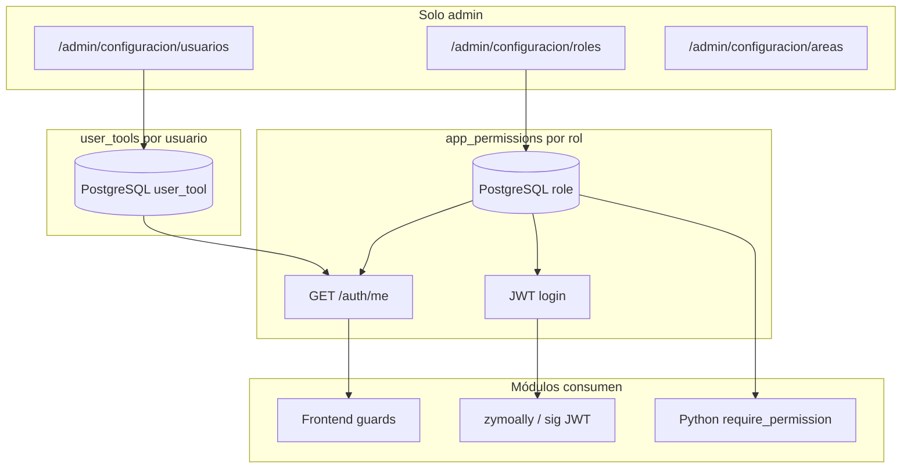

# Mapa — Configuración admin existente

No existe un portal único `/admin/configuracion`. La configuración está **fragmentada** en el triángulo admin + configs por módulo.

## Triángulo admin (solo `admin`)

Acceso: menú usuario (TopBar) o nav `AdminConfigNav` entre pantallas.

| Ruta | Componente | Función |
|------|------------|---------|
| `/admin/configuracion/usuarios` | `AdminPage.tsx` | CRUD usuarios, `user_tools`, equipos tareas, tab Config SMTP tareas |
| `/admin/configuracion/roles` | `RolesPage.tsx` | CRUD roles + checkboxes `app_permissions` |
| `/admin/configuracion/areas` | `AreasPage.tsx` | Áreas globales, sedes, cargos T&C |

**Nav compartida:** `frontend/src/components/admin/AdminConfigNav.tsx` (desde 2026-07-15).

**Guard:** `AdminRoute` en `App.tsx` — `user.role !== "admin"` → redirect `/dashboard`.

## Dos sistemas de acceso (no confundir)

### A) Permisos por rol — `app_permissions`

- Tabla PostgreSQL `role.app_permissions` (JSON array).
- UI: RolesPage → checkboxes desde `frontend/src/lib/roles.ts`.
- Frontend: `GET /auth/me` → `authStore.user.app_permissions`.
- JWT (desde 2026-07-15): incluye `app_permissions` al login.
- Backend Python: resuelve permisos desde BD (`user_has_permission`), no del JWT.

### B) Herramientas por usuario — `user_tools`

- Tabla `user_tool` (`user_id`, `tool_key`, `is_active`).
- UI: AdminPage → botón "Herramientas" por usuario.
- API: `backend/app/routers/user_tools.py` (admin only).
- **Solo 2 keys hoy** (hardcoded en `AdminPage.tsx`):
  - `tool_task_submit_dev` — Gestión de Tareas colaborador
  - `tool_task_manage_dev` — Gestión de Tareas gestor
- Gating: `canSubmitDevTasks` / `canManageDevTasks` en `permissions.ts`.

## Configuración dispersa (otros módulos)

| Ubicación | Guard UI | Qué configura |
|-----------|----------|---------------|
| AdminPage tab "Configuración" | Admin | SMTP + webhook Tareas (`task-backend`) |
| `/oc/configuracion` | AdminRoute | OC SMTP, listas, emails *(backend también acepta `mod_oc_config`)* |
| `/financiero/configuracion` | AdminRoute | Financiero |
| `/tc/ajustes` | `mod_tc` + edit | Paquetes formación, SMTP, WhatsApp T&C |
| `TicketConfigDialog` | `mod_tickets_config` | Listas PQR + botón sync directorio |
| `/admin/extraccion-ia` | Admin o `mod_extraccion_ia` | Motor IA extracción |

## Diagrama

## APIs admin relevantes

| Método | Endpoint | Guard |
|--------|----------|-------|
| GET/PATCH/POST/DELETE | `/roles` | admin |
| GET/POST/PATCH/DELETE | `/auth/users` | admin |
| POST/DELETE | `/api/admin/asignar-tool`, `revocar-tool` | admin |
| GET/POST/PATCH/DELETE | `/areas`, `/sedes` | admin (CRUD) |
| GET | `/areas`, `/sedes` | cualquier usuario autenticado (lectura) |
